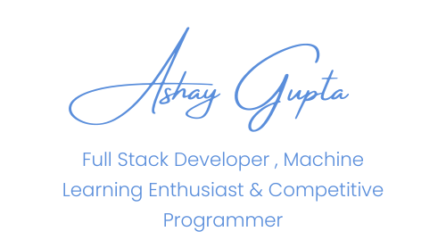

    

;Ping+me+to+collaborate!;Let's+build+something+amazing!;Open+to+new+opportunities!;Always+ready+to+discuss+tech!" width="250"/>
  
  
  
  
  
  
  
  

## 

- 🎓 **B.Tech CSE student** driven by curiosity and caffeine - building things that blend logic with creativity.  
- 😮‍💨 **Competitive programmer & passionate about writing elegant algorithms!** (Won 5× coding competitions!)
- 🧠 Obsessed with **Machine learning, AI agents, RAG & more** (Let AI handle the boring stuff, right?).
- 🔍 Passionate about creating systems that **learn**, **adapt**, and make life just a bit smarter.
- 🌱 Whether it’s optimizing code or designing intuitive user experiences, I believe in progress through persistence.  
- 🛠️ Constantly exploring, building, breaking, and rebuilding - because growth is iterative.  
- 💫 **_Do more of what you love._**

## 

|                                                                                                         **Programming Languages**                                                                                                          |                                                                                                                                                              **Web Development**                                                                                                                                                              |                                                                                                                 **Databases & Tools**                                                                                                                  |                                                                   **AI/ML & Data Science**                                                                   |
| :----------------------------------------------------------------------------------------------------------------------------------------------------------------------------------------------------------------------------------------: | :-------------------------------------------------------------------------------------------------------------------------------------------------------------------------------------------------------------------------------------------------------------------------------------------------------------------------------------------: | :----------------------------------------------------------------------------------------------------------------------------------------------------------------------------------------------------------------------------------------------------: | :----------------------------------------------------------------------------------------------------------------------------------------------------------: |
|      |        |     |    |

|                                   **DevOps & Infrastructure**                                   |                                  **Design & Development Tools**                                  |                                       **Operating Systems**                                       |
| :---------------------------------------------------------------------------------------------: | :----------------------------------------------------------------------------------------------: | :-----------------------------------------------------------------------------------------------: |
|   |   |   |

## 

| **Project**                  | **Description**                                                                                                                          |                                                                                                                  **Tech Stack**                                                                                                                  |                                        **Links**                                         |
| :--------------------------- | :--------------------------------------------------------------------------------------------------------------------------------------- | :----------------------------------------------------------------------------------------------------------------------------------------------------------------------------------------------------------------------------------------------: | :--------------------------------------------------------------------------------------: |
| 🤖 **Face-PCA Reconstruction**  (2025 September)      |     Web-based tool that reconstructs facial images from PCA components, enabling visual analysis of high-dimensional data. (Kind of image compression)                                 |      |           [📂 Code](https://github.com/ashaygupta-cc/FacePCA-Reconstruction) (public)           |
| 🌐 **FlashDB**  (2025 October)         | Local-based superfast CLI system supporting manual + file-based queries, capable of handling billions of records with full user privacy. Current v3 is 1000× faster than MongoDB! Currently working on V4!                                                         |     |     (Private)    |
| 🛡️ **GitViz**  (2025 August)       | Interactive GitHub repository visualizer showing repos, commits, and file structures with AI-assisted insights                |     |  [🔗 Live](https://git-viz-frontend.vercel.app/)   [📂 Code](https://github.com/ashaygupta-cc/GitViz-Frontend) (public)  |
| 🛒 **Green Hydrogen MRV** (2025 September) | Green Hydrogen blockchain-based MRV system, fully functional and completely decentralized; supports RWA tracking, minting, and trading.          |                                                    |                          (Private + Coming Soon)                          |
| 🏭 **Blue Carbon MRV+Trade** (2025 October)           | Blockchain-based MRV system for blue carbon assets, fully decentralized with IoT-enabled verification; supports RWA tracking, minting, trading, and real-time monitoring for environmental impact and compliance. |                                |  (Private + Coming Soon) |  
| 🏭 **Portfolio-Website** (2025 June)             |  A portfolio website inspired by the Fire Breathing and Water Breathing techniques from Demon Slayer. It blends bold, fiery visuals with smooth, fluid transitions reflecting both passion and precision in every detail. | !                              |   [🔗 Live](https://portfolio-website-ashay.vercel.app/)   [📂 Code](https://github.com/ashaygupta-cc/Portfolio-Website-Frontend) (public)  | |  

## 

|                                                                                                      **📊 GitHub Analytics**                                                                                                      |                                                                                         **🔥 Contribution Streak**                                                                                          |
| :-------------------------------------------------------------------------------------------------------------------------------------------------------------------------------------------------------------------------------: | :---------------------------------------------------------------------------------------------------------------------------------------------------------------------------------------------------------: |
|  |  |

|                                                                                                        **🌟 Most Used Languages**                                                                                                         |
| :---------------------------------------------------------------------------------------------------------------------------------------------------------------------------------------------------------------------------------------: |
|  |

|                                                                                           **📈 Contribution Graph**                                                                                           |
| :-----------------------------------------------------------------------------------------------------------------------------------------------------------------------------------------------------------: |
|  |

⭐ **Thanks for visiting my profile!** Let's build something amazing together.

