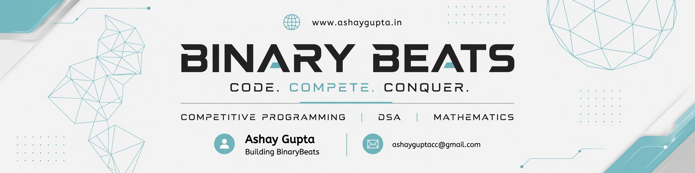

<p align="center">
  
</p>

<div align="center">


<br/>

<a href="https://ashaygupta.in">
  
</a>
   

<br/><br/>

<a href="mailto:ashay051204@gmail.com"></a>
<a href="https://portfolio-website-ashay.vercel.app/"></a>
<a href="https://www.linkedin.com/in/ashay-shiva"></a>
<a href="https://www.instagram.com/ashay.shiva"></a>
<a href="https://x.com/ZodiacZ408"></a>
<a href="https://discord.com/users/1406920647325515828"></a>
<a href="https://github.com/ashaygupta-cc"></a>
<a href="https://codeforces.com/profile/ZodiacZ408"></a>
<a href="https://leetcode.com/u/ashaygupta_cc/"></a>
<a href="https://www.codechef.com/users/ashaygupta_cc"></a>
<a href="https://codolio.com/profile/ashay_shiva"></a>

<br/><br/>

</div>


## 𝗔𝗯𝗼𝘂𝘁 𝗠𝗲


Building 
<a href="https://www.linkedin.com/company/binarybeatshq">
**Binary Beats**
</a>
 !
<br/>
*A student-driven community fostering Competitive Programming, DSA, Mathematics, mentorship, and peer-to-peer learning.*

<br/>

```
  Codeforces Expert               ◆  Highest Rating 1730
  CodeChef 4 Star                 ◆  Highest Rating 1810
  Matiks Candidate I              ◆  Highest Rating 2001
  1300+ Problems Solved           ◆  CF,LC,CC,AtCoder,CSES Combined
  Inter IIIT Finalist             ◆  CP Competitions Winner x4
  Hackathon Finalist x4             
```

```
INTERESTED IN :

  Competitive Programming
  Agentic AI
  Machine Learning
  Operating Systems
  Computer Networks
  DBMS
```

<br clear="right"/>


## 𝗧𝗲𝗰𝗵 𝗔𝗿𝗺𝗼𝗿𝘆

<div align="center">

| **Programming Languages** | **Web Development** | **Databases & Tools** | **AI/ML & Data Science** |
|:--:|:--:|:--:|:--:|
|      |        |     |    |

| **DevOps & Infrastructure** | **Design & Dev Tools** | **Operating Systems** |
|:--:|:--:|:--:|
|   |   |   |

</div>


## 𝗪𝗼𝗿𝗸 𝗛𝗶𝗴𝗵𝗹𝗶𝗴𝗵𝘁𝘀

| **Project** | **Description** | **Tech Stack** | **Links** |
| :-- | :-- | :--: | :--: |
| ⚡ **CP Sync** *(May 2026)* | Unified dashboard to sync and track competitive programming stats across Codeforces, LeetCode and CodeChef. |    | [📂 Code](https://github.com/ashaygupta-cc) |
| 🤖 **Face-PCA Reconstruction** *(Sep 2025)* | Reconstructs facial images from PCA components — visual analysis of high-dimensional data. |     | [📂 Code](https://github.com/ashaygupta-cc/FacePCA-Reconstruction) |
| 🗄️ **FlashDB** *(Oct 2025)* | Ultra-fast local CLI database with manual + file-based queries and full privacy. v3 outperforms MongoDB significantly. |   | Private |
| 🔭 **GitViz** *(Aug 2025)* | Interactive 3D GitHub repo visualizer — commits, structures and AI-assisted insights. |     | [🔗 Live](https://git-viz-frontend.vercel.app/) · [📂 Code](https://github.com/ashaygupta-cc/GitViz-Frontend) |
| ⚗️ **Green Hydrogen MRV** *(Sep 2025)* | Blockchain-based MRV system for RWA tracking, minting and decentralized carbon credit trading. |   | Private |
| 🌿 **Blue Carbon MRV+Trade** *(Oct 2025)* | Decentralized MRV ecosystem with IoT-enabled verification and real-time environmental asset monitoring. |   | Private |
| 🌊 **Portfolio Website** *(Jun 2025)* | Anime-inspired portfolio with smooth transitions and bold visuals — Demon Slayer aesthetic. |    | [🔗 Live](https://portfolio-website-ashay.vercel.app/) · [📂 Code](https://github.com/ashaygupta-cc/Portfolio-Website-Frontend) |


## 𝗚𝗶𝘁𝗛𝘂𝗯 𝗦𝘁𝗮𝘁𝘀

<div align="center">

| **📊 GitHub Analytics** | **🔥 Contribution Streak** |
| :--: | :--: |
|  |  |

| **👾 Pac-Man Contribution History** |
| :--: |
| <picture><source media="(prefers-color-scheme: dark)" srcset="https://raw.githubusercontent.com/ashaygupta-cc/ashaygupta-cc/output/pacman-contribution-graph-dark.svg"><source media="(prefers-color-scheme: light)" srcset="https://raw.githubusercontent.com/ashaygupta-cc/ashaygupta-cc/output/pacman-contribution-graph.svg"></picture> |

</div>


## 𝗖𝘂𝗿𝗿𝗲𝗻𝘁 𝗙𝗼𝗰𝘂𝘀

```
▸ Daily Competitive Programming
▸ Operating Systems
▸ Low Level Design / System Design
▸ DBMS
▸ Machine Learning
· Agentic AI
```


## 𝗣𝗿𝗼𝗴𝗿𝗲𝘀𝘀

```
Competitive Programming   ██████████████  95%
Core CS Revision          ██████████░░░░  70%
System Design             ████████░░░░░░  55%
Projects & Development    ████░░░░░░░░░░  30%
```


## 𝗣𝗵𝗶𝗹𝗼𝘀𝗼𝗽𝗵𝘆

> I started below average, but with time and consistency, I kept improving.
> I love hard work, pressure and pushing myself beyond limits.
> I am never satisfied with what I did. I just keep doing what is necessary.


<div align="center">

<br/>


</div>
